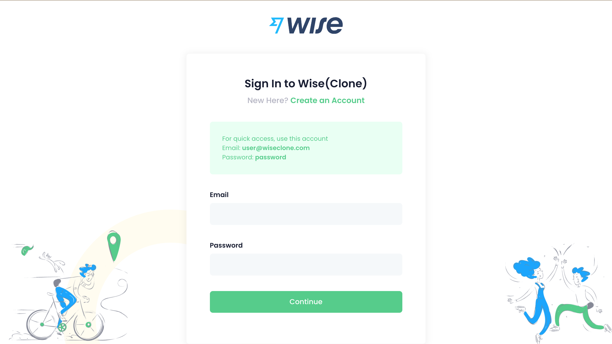
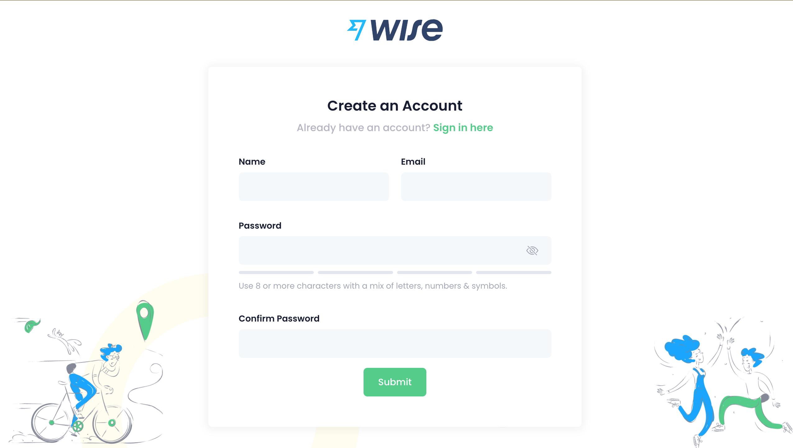
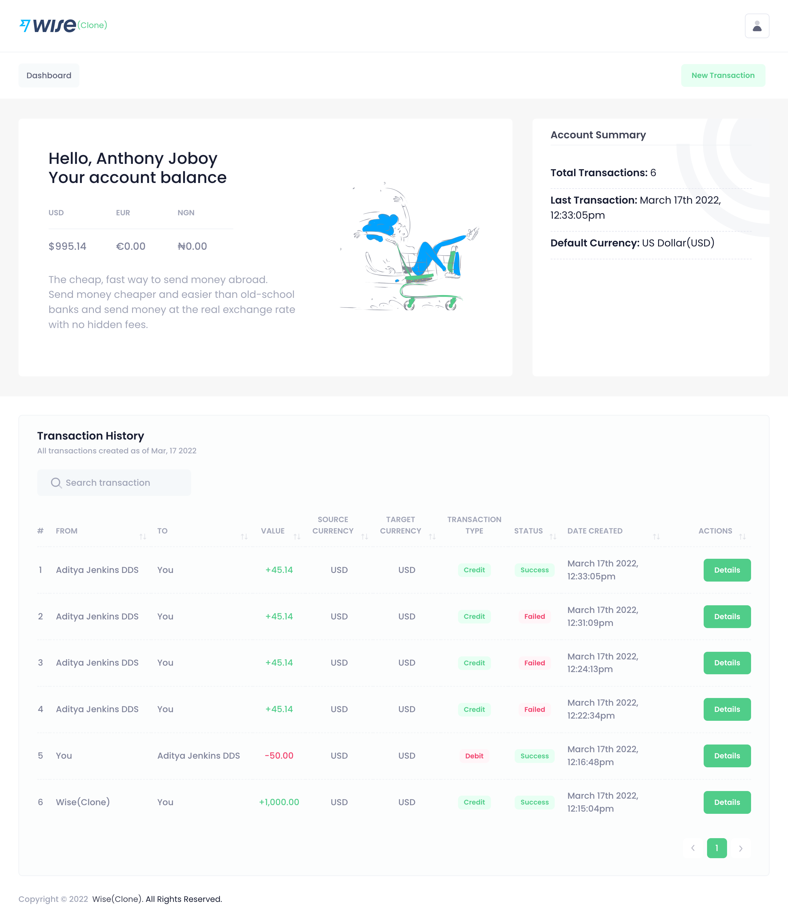
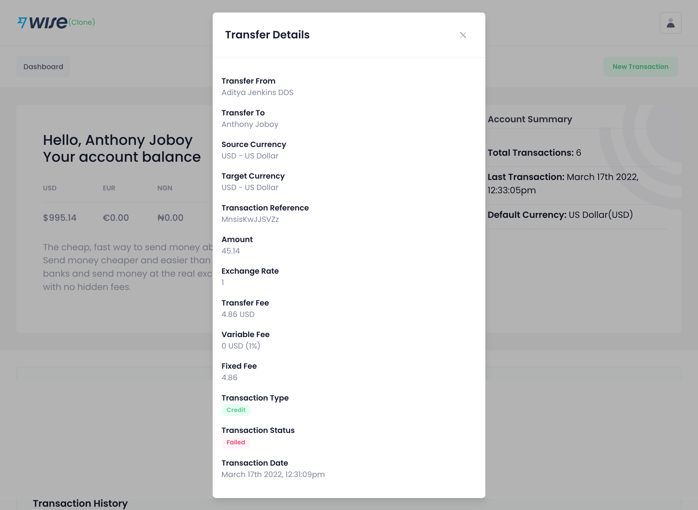

#  Wise (Clone)

This test was created by the IBN Software Development team based on the need to measure and determine an applicant's hands-on experience in creating web applications from scratch. The challenge is to create a web app where users can send virtual money in the currencies of their choice (USD, EUR, or their local currency) to each other.

## Test Benefits

This test should give us a good understanding of:

- How well you can go from text to code, from requirements to product.
- How well you can execute on predefined requirements.
- How well do you pay attention to detail so we can rely on you to execute the work end to end.
- How creatively you execute on vague requirements (that haven't been defined in great detail).
- How well can you hack, organize, document, test, structure, and write your code.
- How well you can leverage existing things to build this app fast.

## Development Stacks

Our development stack will include the following:

### Front-End

- HTML5
- CSS3
- Tailwind CSS(optional)
- JavaScript
- Bootstrap 4 or 5 Vue/React template
- React JS/Vue.js

### Back-End

- Laravel or Node.js

### Database
- MySQL or PostgreSQL or MongoDB

## About Wise (Clone)

[Wise](https://www.wise.com) allows you to transfer money abroad easily and quickly with low-cost money transfers. You can send money at the real exchange rate with no hidden fees. This web application features the following pages:

1. A login page.
2. A registration page.
3. A dashboard page, where transactions will be listed.
4. A transaction page.

## Features

- Money can be sent/converted into any of the three currencies to be sent to another user.
- Money can be sent/converted to any and every user who is registered on the app.
- The user to send the money to can be chosen from a select option list which shows all users if clicked on. (Tip: Create at least two users as a seed.)
- A user cannot have a negative balance. All users start with 1000 USD worth of money given via an initial transaction when you create them.
- All users start with USD as their default currency but can receive EUR and NGN.
- All database tables must have the `created_at` and `updated_at` timestamps, which should be populated automatically.
- API integration to get current exchange rate from [Free Currency Converter API](https://www.currencyconverterapi.com/) or any other free currency converter or a hand-coded list of exchange rates.
- A method to record failed transactions following the `ACID` database transaction principle.
- A feature to refund the dollar account once it is completely exhausted.

## TODO's

- A user can register with his name, email address, and password.
- A user can log in with his email address and password, which is encrypted using a good encryption system (we've been taught some encryption techniques).
- You don’t need to implement a `forgot password` feature. The Registration and Login pages are enough.
- When a user successfully logs in, he/she sees a page with all of his transactions, including the initial transaction from the registration (1000 USD).
- The page with all the transactions also shows the current balance for each currency. (e.g., start: 1000 USD, 0 EUR, 0 NGN).
- A user can execute a new transaction from the transaction page.
- A transaction consists of the sender and the receiver, the source currency, target currency, exchange rate, and the amount.
- A user can select the target recipient and currency.
- Check if a transaction is possible, by validating if the user has enough funds in his/her selected source currency.
- Be smart, use dependencies, plugins to speed up your development process. Avoid DRY.
- List the appropriate steps to successfully run this application on a local environment in the [Wise (Clone) Application Development Procedures](#wise-clone-application-development-procedures) section below.
- Deploy the application and provide the links to: 
  - your public GitHub repository.
  - the hosted application.
- Provide Login credentials to two dummy accounts for testing.

Practical Example:

- User A sends to User B 100 EUR.
- But User B wants to receive that in USD. Therefore, User A has -100 EUR after that transaction.
- Finally, User B is credited with 113 USD, depending on the exchange rate.

## Git Instructions

When you start developing, commit all of your work on a topic branch:

- Before merging with the main branch
- Make sure to give the topic branch clear, descriptive name

As a general best practice for writing commits:

- Make frequent, smaller commits
- Use clear and descriptive commit messages
- Update the README file, if necessary

## Wise (Clone) Application Development Procedures

List the appropriate steps to successfully run this application on a local environment.

## Project Final Result Screenshots

Link to the online [Demo](http://wiseclone.edgemep.com.ng)

